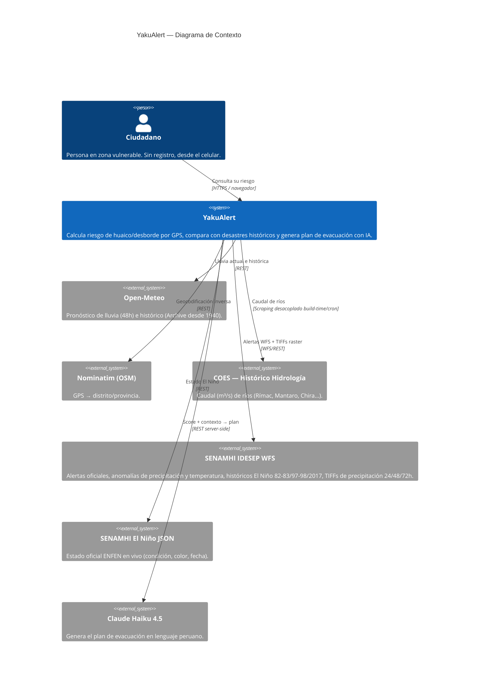
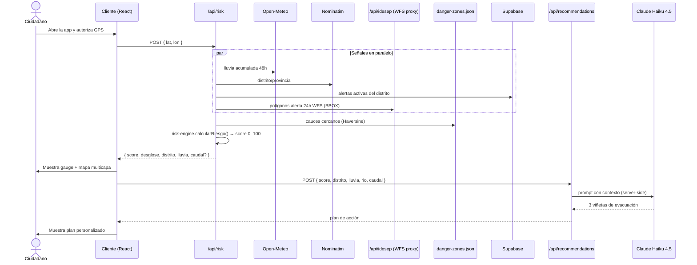

# Arquitectura — YakuAlert

Documento de arquitectura del prototipo (Hito 1). Sigue el modelo [C4](https://c4model.com/):
nivel 1 (Contexto), nivel 2 (Contenedores) y un diagrama de secuencia del flujo crítico.

---

## 1. Contexto (C4 — Nivel 1)

Quién usa el sistema y con qué sistemas externos habla.



---

## 2. Contenedores (C4 — Nivel 2)

Módulos principales y cómo se comunican. El **navegador headless de scraping nunca está en el
runtime** (ver [ADR-006](adr/ADR-006-scraping-desacoplado.md)).

```mermaid
flowchart TB
    subgraph Cliente["📱 Cliente (Next.js / React, mobile-first)"]
        UI["UI: gauge de riesgo, mapa multicapa Leaflet,\ngráfico histórico, plan IA, panel config"]
        LS[("LocalStorage\nperfil del usuario")]
    end

    subgraph Vercel["☁️ Vercel (serverless)"]
        APIrisk["/api/risk\n(orquestador)"]
        APIrec["/api/recommendations\n(IA — Claude Haiku 4.5)"]
        APIhist["/api/history\n(comparativa histórica)"]
        APIhydro["/api/hydrology\n(caudal COES desde Supabase)"]
        APIalerts["/api/alerts\n(alertas COEN/SENAMHI)"]
        APIidesep["/api/idesep\n(proxy WFS + TIFFs SENAMHI)"]
        Engine["lib/risk-engine\n(función pura: Haversine + score)"]
        Zones[("data/danger-zones.json\ncauces históricos")]
    end

    subgraph Datos["🗄️ Supabase (PostgreSQL)"]
        DB[("active_alerts · hydrology_readings\ncommunity_reports · alert_logs")]
    end

    subgraph Externos["🌐 APIs externas"]
        Meteo["Open-Meteo\nForecast + Archive"]
        Nom["Nominatim"]
        IA["Claude Haiku 4.5"]
        IDESEP["SENAMHI IDESEP\nWFS GeoJSON + TIFFs"]
        SENAJSON["SENAMHI El Niño JSON"]
    end

    subgraph BuildTime["🛠️ Build-time / Cron (fuera del runtime)"]
        AB["agent-browser\n(harvest + descubre endpoint COES)"]
        COES["COES Histórico Hidrología"]
    end

    UI -->|lat/lon| APIrisk
    UI <-->|perfil| LS
    APIrisk --> Engine
    APIrisk -->|lluvia 48h| Meteo
    APIrisk -->|distrito| Nom
    APIrisk --> Zones
    APIrisk -->|alertas activas| DB
    UI -->|score, distrito| APIrec --> IA
    UI --> APIhist -->|2017/2023| Meteo
    UI --> APIhydro -->|lee caudal| DB
    UI --> APIalerts -->|lee| DB
    UI --> APIidesep -->|proxy WFS/TIFF| IDESEP
    APIidesep --> SENAJSON

    AB -.->|maneja form| COES
    AB -.->|siembra caudales| DB
```



---

## 3. Mapa multicapa — detalle de capas IDESEP

El mapa Leaflet renderiza capas en este orden (de abajo hacia arriba):

```
Capa 4 (top): Polígonos rojos — aviso lluvia intensa 24h (g_prono_pp_24h WFS)
Capa 3:       Puntos de estaciones — anomalía precipitación coloreada (g_04_02 WFS)
Capa 2:       Círculos rojos — cauces y quebradas históricas (danger-zones.json)
Capa 1:       TIFF overlay — precipitación continua 24h (raster IDESEP)
Capa 0 (base):OpenStreetMap
```

Los TIFFs se cargan con `georaster-layer-for-leaflet` desde:
- 24h: `PT_03_05_001_03_000_513_0000_00_00.tif`
- 48h: `PT_03_05_002_03_000_513_0000_00_00.tif`
- 72h: `PT_03_05_003_03_000_513_0000_00_00.tif`

Los WFS se consultan con filtro BBOX alrededor del GPS del usuario (buffer 0.5°).

---

## 4. Flujo crítico: "Calcular mi riesgo" (secuencia)

El camino feliz de la funcionalidad central. Diseñado para **degradar con elegancia**: si COES
o las alertas fallan, el score se calcula igual con lluvia + cercanía a cauce.



---

## 5. Motor de riesgo (núcleo testeable)

`lib/risk-engine.ts` se diseña como **función pura** (sin I/O) → fácil de testear (requisito
del Hito 2: happy path + caso de error).

**Score (0–100)** = suma ponderada de tres señales:

| Señal | Peso | Fuente | Cálculo |
|-------|------|--------|---------|
| Cercanía a cauce peligroso | 40 | `danger-zones.json` (Haversine) | < 500m ⇒ 40 pts (decae con distancia) |
| Lluvia pronosticada (48h) | 40 | Open-Meteo + IDESEP WFS `g_03_05` | > 15mm ⇒ 40 pts (escala lineal) |
| Vulnerabilidad del distrito | 20 | Alertas COEN/SENAMHI WFS `g_prono_pp_24h` | Alerta activa o distrito históricamente vulnerable ⇒ 20 pts |

**Señal opcional (refuerzo):** cuando hay caudal del COES disponible en Supabase, refuerza la
señal de lluvia comparando caudal actual vs percentil histórico 2017/2023. Si COES no responde,
el motor calcula igual con las tres señales base.

| Rango | Nivel | Color | Acción |
|-------|-------|-------|--------|
| 0–33 | Bajo | 🟢 verde | Monitoreo |
| 34–66 | Moderado | 🟡 ámbar | Preparación |
| 67–100 | Alto | 🔴 rojo | Evacuación + vibración física |

---

## 6. Resiliencia — degradación elegante

| Fallo | Comportamiento |
|-------|----------------|
| COES no responde | `/api/hydrology` sirve datos sembrados en Supabase / mock realista |
| IDESEP WFS lento | Timeout 3s → el mapa muestra solo `danger-zones.json` y Open-Meteo |
| Claude Haiku falla | 3 recomendaciones estáticas INDECI según nivel (ver `docs/prompts/`) |
| Supabase caída | Motor opera solo con Open-Meteo + Haversine (núcleo no depende de DB) |

**Invariante:** el score de riesgo **siempre se calcula** mientras haya GPS + Open-Meteo.
