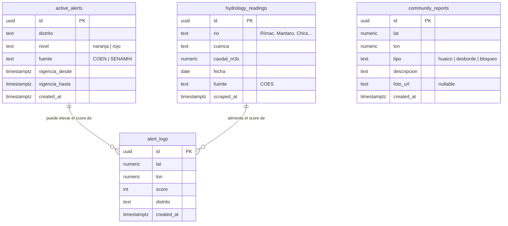

# Modelo de datos — YakuAlert

Persistencia híbrida: **Supabase (PostgreSQL)** para datos compartidos y **LocalStorage** para
el perfil del usuario (sin registro, ver [ADR-0001](adr/0001-sin-auth.md)).

---

## Diagrama entidad-relación (Supabase)



> `active_alerts` y `alert_logs` no tienen FK estricta (se relacionan por `distrito` y por
> proximidad geográfica en la lógica del motor); el diagrama muestra la relación conceptual.

---

## Tablas

### `active_alerts`
Alertas oficiales vigentes por distrito (scraping COEN/SENAMHI o *mock*).
Consumida por `/api/alerts` y por el motor (señal de vulnerabilidad, 20 pts).

### `hydrology_readings`
Caché de caudales del COES (ver [ADR-0006](adr/0006-scraping-desacoplado.md)). Escrita por el
proceso de scraping **desacoplado** (build-time/cron), leída por `/api/hydrology`. Incluye tanto
los caudales históricos (marzo 2017/2023) como las lecturas recientes.

### `community_reports`
Reportes ciudadanos (huaico/desborde/bloqueo) con ubicación. Función de valor agregado;
prioridad posterior al núcleo.

### `alert_logs`
Registro de cada cálculo de riesgo (auditoría/analítica). Permite mostrar "consultas recientes"
y evaluar el comportamiento del motor.

---

## Datos estáticos (versionados en el repo)

### `data/danger-zones.json`
Catálogo de cauces y quebradas históricamente peligrosos. **No va en Supabase** (dato estable,
versionable, sin latencia). Estructura prevista:

```jsonc
[
  {
    "id": "quebrada-quirio",
    "nombre": "Quebrada Quirio",
    "distrito": "Lurigancho-Chosica",
    "rio": "Rímac",            // mapea a la estación COES
    "cuenca": "Rímac",
    "coords": [[-11.93, -76.69], [-11.94, -76.70]]  // puntos del cauce
  }
]
```

### Perfil del usuario (LocalStorage, no en servidor)
```jsonc
{
  "ubicacionGuardada": { "lat": -11.93, "lon": -76.70, "etiqueta": "Casa" },
  "ultimoScore": 72,
  "configuracion": { "alertasActivas": true }
}
```
