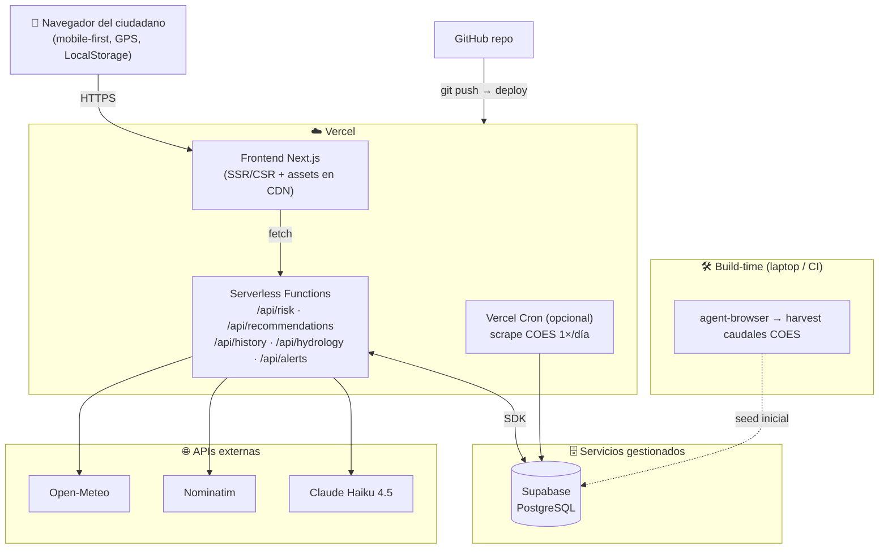

# Despliegue — YakuAlert

Despliegue *serverless* en **Vercel**, con Supabase como backend gestionado y el scraping COES
fuera del runtime (ver [ADR-0002](adr/0002-vercel-vs-sam.md) y [ADR-0006](adr/0006-scraping-desacoplado.md)).

---

## Diagrama de despliegue

---

## Variables de entorno

Variables previstas (el archivo `.env.example` se añadirá con el código en el Sprint 1):

| Variable | Ámbito | Uso |
|----------|--------|-----|
| `ANTHROPIC_API_KEY` | Server | Generación del plan IA |
| `ANTHROPIC_MODEL` | Server | `claude-haiku-4-5` |
| `NEXT_PUBLIC_SUPABASE_URL` | Cliente | Conexión Supabase |
| `NEXT_PUBLIC_SUPABASE_ANON_KEY` | Cliente | Lectura pública (RLS) |
| `SUPABASE_SERVICE_ROLE_KEY` | Server/cron | Escritura del scraping (nunca en cliente) |
| `NOMINATIM_USER_AGENT` | Server | Identificación requerida por Nominatim |

---

## Flujo de despliegue

1. `git push` a `main` → Vercel construye y despliega automáticamente.
2. El timestamp del deploy en Vercel sirve como verificación complementaria del Hito 2.
3. Supabase se provisiona una sola vez (proyecto gratuito) y se aplican las tablas de
   [`data-model.md`](data-model.md) vía SQL.
4. El seed de caudales COES se ejecuta **una vez** en build-time (no bloquea el deploy).

## Resiliencia (demo a prueba de fallos)
- Si **COES** no responde → `/api/hydrology` sirve datos sembrados / *mock* (Chosica, Piura).
- Si **COEN/SENAMHI** falla → `active_alerts` usa *mock* precargado.
- Si **la IA** falla → la app muestra recomendaciones estáticas de respaldo.
- El **núcleo** (riesgo por GPS + lluvia + cauce) no depende de ninguna de las anteriores.
